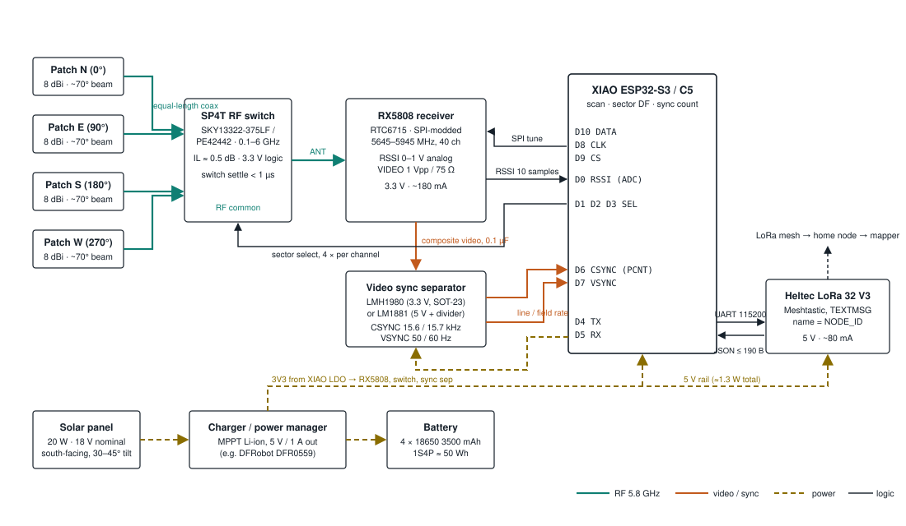

# Level 1 station v2 — sector direction finding + video fingerprint

Status: **firmware implemented, hardware not yet bench validated.** This is the
build spec for the Level 1 station. The firmware in `level1-analog-fpv/` implements
it and builds for both boards; the bench procedure in the
[bench guide](Level1-Station-v2-Bench-Guide.pdf) is what turns it into a fielded
unit. It keeps the RX5808, the XIAO and the Heltec and adds two things:

1. **Four sector patch antennas behind an SP4T RF switch.** Every channel visit
   reads RSSI on all four sectors. The ratio between the strongest sector and its
   neighbours gives a bearing (~±15°). Two stations with bearings give a fix by
   triangulation with no transmitter-power assumption at all; combined with the
   differential-RSSI solver already on `main`, bearings tighten every fix.
2. **A video sync separator on the RX5808's unused video output.** A real analog
   video carrier produces a 15.6/15.7 kHz line-sync train and a 50/60 Hz field
   sync; Wi-Fi, ISM junk and noise do not. This kills the false positives and
   yields a per-drone **fingerprint** (PAL/NTSC, exact line rate, VTX frequency
   offset) that the mapper can use to keep one drone one track across channels
   and stations.

3.3 GHz (RX3364) is parked; nothing here blocks it, the pin budget below leaves
the carrier's D-pin assignment compatible with the RX3364 plan.



*Four patches → SP4T → RX5808. RSSI and SPI to the XIAO as today; the video pin
feeds the sync separator, whose CSYNC/VSYNC land on two counter-capable GPIOs.
Solar → charger/battery → 5 V rail → XIAO and Heltec; the XIAO's 3V3 LDO feeds the
receiver, switch and sync separator.*

## 1. Parts list

Prices are rough single-unit figures for planning. Quantities are per station.

### RF front end

| # | Part | Qty | Notes | ~Cost |
|---|------|-----|-------|-------|
| 1 | **RX5808** 5.8 GHz receiver module, SPI-modded | 1 | Same module as v1. Remove the SPI-disable resistor if the batch ships with it. Keep its own u.FL/IPEX antenna pad for the switch feed | $8 |
| 2 | **5.8 GHz patch antenna, 8 dBi, ~70° beamwidth, SMA** | 4 | Linear or RHCP. Linear costs 3 dB against an RHCP VTX but is polarisation-agnostic (LHCP VTXs exist); RHCP gains 3 dB on the common case and loses ~20 dB on LHCP. Buy four identical units from one batch so the patterns match | $8 ea |
| 3 | **SP4T RF switch, 0.1–6 GHz, 3.3 V CMOS control** | 1 | Skyworks **SKY13322-375LF** or pSemi **PE42442**. ~0.5 dB insertion loss at 5.8 GHz, sub-µs switching. Verify the control truth table and pin count (2 or 3 lines) in the datasheet of whichever you buy. For the prototype use the vendor evaluation board; for the carrier PCB the bare IC | $3 IC / ~$40 EVB |
| 4 | u.FL ↔ SMA pigtails, **equal length, ≤ 15 cm** | 5 | Four patches + switch common to RX5808. Equal length keeps sector losses matched | $2 ea |
| 5 | SMA bulkhead feedthroughs | 4 | One per enclosure face | $2 ea |
| 6 | 5.8 GHz band-pass filter (optional) | 1 | Between switch and RX5808 if a 2.4 GHz Wi-Fi AP overloads the front end on the bench | $5 |

### Video fingerprint

| # | Part | Qty | Notes | ~Cost |
|---|------|-----|-------|-------|
| 7 | **Sync separator: TI LMH1980** (3.3 V, SOT-23-6) | 1 | 3.3 V supply, 3.3 V CMOS outputs straight to the XIAO, auto-detects SD/HD. Preferred | $3 |
| 7b | *alt:* **LM1881N** (DIP-8) | 1 | 5 V part; needs the 5 V rail and a 2:1 resistor divider (or 74LVC1G17) on each output to the XIAO. Fine for a breadboard prototype | $2 |
| 8 | 0.1 µF video coupling capacitor, 75 Ω termination | 1 each | Per sync-separator datasheet; LM1881 also needs 680 kΩ RSET + 0.1 µF | $0.50 |

### MCU and mesh (unchanged from v1)

| # | Part | Qty | Notes | ~Cost |
|---|------|-----|-------|-------|
| 9 | **Seeed XIAO ESP32-S3** or **XIAO ESP32-C5** | 1 | Firmware picks the pinout at compile time | $8–10 |
| 10 | **Heltec WiFi LoRa 32 V3** + 868/915 MHz antenna | 1 | Meshtastic, serial module TEXTMSG 115200, node name = `NODE_ID` | $20 |

### Power (unattended solar)

| # | Part | Qty | Notes | ~Cost |
|---|------|-----|-------|-------|
| 11 | **Solar panel 20 W, 18 V nominal** | 1 | South-facing, 30–45° tilt. 10 W is enough in summer only | $25 |
| 12 | **Solar charger / power manager with MPPT and 5 V / 1 A output** | 1 | e.g. DFRobot Solar Power Manager 5V (DFR0559) or Waveshare Solar Power Manager. Takes the 18 V panel, charges 1S Li-ion, gives a regulated 5 V rail | $15 |
| 13 | **18650 Li-ion 3500 mAh** in a 1S4P holder | 4 | ≈ 50 Wh ≈ 38 h at the 1.3 W station load; two dark days. Protected cells or a BMS board | $6 ea |
| 14 | 1000 µF low-ESR capacitor on the 5 V rail near the Heltec | 1 | LoRa TX bursts | $1 |

### Mechanical

| # | Part | Qty | Notes | ~Cost |
|---|------|-----|-------|-------|
| 15 | **IP65 enclosure ≈ 200 × 150 × 100 mm**, UV-stable ABS/PC | 1 | Patches on the four vertical faces at 0°/90°/180°/270°, each tilted 10–15° up | $15 |
| 16 | Cable gland for the solar lead; desiccant pack | 1 | | $3 |
| 17 | Pole/wall bracket; 4 patch brackets with 10–15° wedge | 1 set | Face N to true north and record the heading; a mis-oriented box rotates every bearing | $10 |
| 18 | 2 kΩ series resistors on the switch control lines; 100 nF decoupling ×4; 10 µF on the RX5808 supply | — | | $1 |

Total per station ≈ **$190** including panel and battery; ≈ $95 for the
electronics alone. The v1 station was ≈ $45 without power.

## 2. Pin budget

Every XIAO D-pin is used. The firmware takes GPIO numbers from the Arduino core's
XIAO variant (`pins_arduino.h`) through `config.h`, so the same source builds for
both boards.

| XIAO pin | S3 GPIO | C5 GPIO | Use |
|----------|---------|---------|-----|
| D0 | 1 | 1 | RSSI (ADC) |
| D1 | 2 | 0 | switch select V1 |
| D2 | 3 | 25 | switch select V2 |
| D3 | 4 | 7 | switch select V3 (unused if the switch decodes 2 lines) |
| D4 | 5 | 23 | Heltec RX (UART TX) |
| D5 | 6 | 24 | Heltec TX (UART RX) |
| D6 | 43 | 11 | CSYNC → GPIO interrupt (edge count) |
| D7 | 44 | 12 | VSYNC → GPIO interrupt (edge count) |
| D8 | 7 | 8 | RX5808 CLK |
| D9 | 8 | 9 | RX5808 CS |
| D10 | 9 | 10 | RX5808 DATA |

On both chips D6/D7 are the UART0 default pins; they are free because the console
is USB-CDC.

> ⚠️ **C5 pin map.** Earlier firmware on this branch hard-coded D0 = GPIO2,
> D4 = GPIO6, D5 = GPIO7 for the C5, which disagrees with the variant above. The
> variant is the one trusted here (its D6/D7 match the C5's UART0 defaults exactly
> as the S3's do). Confirm with a continuity test on the first C5 board and record
> the result in the bench guide.

The sync train is counted with GPIO interrupts rather than the PCNT peripheral:
15.7 kHz for 200 ms on a hit is negligible load, and the same code runs unchanged
on both chips.

## 3. Power budget

| Load | Current | Power | Notes |
|------|---------|-------|-------|
| XIAO ESP32-S3/C5, radios off, scanning | ~45 mA @ 3.3 V | 0.25 W from 5 V (LDO) | Light-sleep between sweeps is a firmware option, not needed |
| RX5808 | ~180 mA @ 3.3 V | 0.60 W | The dominant load; it cannot be duty-cycled without losing detections |
| SP4T switch + LMH1980 | < 10 mA | 0.03 W | |
| Heltec V3, Meshtastic, mostly RX | ~80 mA @ 5 V | 0.40 W | + ~120 mA during LoRa TX bursts |
| **Station total** | | **≈ 1.3 W ≈ 31 Wh/day** | |

A 20 W panel at 3 peak-sun hours (winter, some cloud) yields ≈ 60 Wh/day; 50 Wh
of battery carries the station through ~38 h of darkness. The four sector
antennas and the switch add essentially nothing to the v1 budget; four separate
receivers would have doubled it, which is why the switch was chosen.

## 4. How the firmware uses it

Implemented in `level1-analog-fpv/src/` (`main.cpp`, `sector_switch.*`,
`bearing.*`, `video_sync.*`). Per channel visit (same 30 ms PLL settle as before):

```
tune(channel); delay(RX_TUNE_SETTLE_MS)
for sector in N, E, S, W:
    select(sector); delayMicroseconds(SECTOR_SETTLE_US)   # switch + RSSI filter settle
    stats[sector] = read_rssi_stats()                     # RSSI_SAMPLES raw + mV
best = argmax(stats.mean_mv)
confirm best with MIN_DWELL_HITS reads, all >= RSSI_THRESHOLD
sector_dbm = [mv_to_dbm(s.mean_mv) for s in stats]
```

Sweep time: 40 × (30 + 4 × ~3 + ~5 ms) ≈ 1.9 s. After the sweep the
`VIDEO_MAX_PER_SWEEP` strongest due peaks each get a fine-tune (11 steps ≈ 0.36 s)
and a 200 ms sync count.

**Bearing** (amplitude comparison): take the strongest sector `k` and its two
neighbours. With sector powers in dB, `bearing = az[k] + K · (P[k+1] − P[k−1])`,
where `K` (degrees per dB) comes from the measured patch pattern; a bench sweep of
a VTX around the box every 15° fills a small lookup table. Report `bearing_deg`
and `bearing_sigma_deg` (larger when the two neighbours are nearly equal or the
peak is weak).

**Video** (on the peak channel only, after the sweep): hold the tuner, count CSYNC
edges with PCNT for 100 ms and time VSYNC edges for 200 ms.

| Line rate | Field rate | Verdict |
|-----------|------------|---------|
| 15 734 ± 30 Hz | 59.94 Hz | `NTSC` |
| 15 625 ± 30 Hz | 50 Hz | `PAL` |
| no stable train | — | `none` (carrier without video: report with `video:"none"`, mapper may de-prioritise) |

The standard is decided by the **field** rate. The line rate only has to fall
inside 14.5–17 kHz, because an LM1881's composite sync includes equalising and
serration pulses during vertical blanking that lift the edge count ~500 Hz above
nominal; an LMH1980 HSYNC output would sit at the nominal figures.

`sync_q` (0–100) is the fraction of 10 ms slices whose count was within ±3 of
the median slice, i.e. a signal-quality number that does not depend on the RSSI
curve at all.

**Fingerprint** `fp` = `<video>/<line_hz>/<freq_peak>`, e.g. `NTSC/15736/5742`,
where `freq_peak` comes from stepping the synthesizer ±10 MHz in 2 MHz steps
around the hit and taking the RSSI peak. Camera crystals and VTX offsets are
stable per aircraft over a flight, so two stations reporting the same `fp`
are looking at the same drone even if their peak channels differ.

### JSON additions (additive; emitted now, consumed by the mapper next)

```json
"hw": "v2",
"sectors": [-62.1, -68.4, -84.0, -79.2],
"sector": 0,
"bearing_deg": 41,
"bearing_sigma_deg": 14,
"freq_peak": 5742,
"video": "NTSC",
"sync_hz": 15736,
"field_hz": 60,
"sync_q": 96,
"fp": "NTSC/15736/5742"
```

The mesh line carries `bearing_deg`, `bearing_sigma_deg` and `fp` (or
`"video":"none"`), with `rssi_raw`/`rssi_min`/`rssi_max` dropped from the mesh
copy and a 16-bit `seq`, for a worst case of 191 bytes against the 200-byte
limit; the firmware drops the fingerprint, then the bearing, rather than ever
truncating JSON. The mapper on `main` ignores these keys safely today; the next
`main` change adds a bearing residual term to `_analog_solve()` and uses `fp` as
a secondary clustering key alongside frequency.

## 5. Build sequence

1. **Bench the switch.** Eval board, one patch, RX5808 on the common port. Confirm
   the truth table from the XIAO GPIOs and that RSSI is stable < 1 ms after a
   switch. Measure insertion loss by comparing RSSI with and without the switch.
2. **Bench the sync separator.** RX5808 VIDEO → 0.1 µF → separator. Scope CSYNC on
   a real VTX: expect a clean 15.7 kHz train. Confirm it disappears on a Wi-Fi-only
   channel.
3. **Pattern calibration.** Mount the four patches on the box, put a VTX at 30 m on
   a known bearing, rotate the box in 15° steps, log the four `sectors` values.
   This table is the bearing calibration; keep it in `docs/`.
4. **Carrier PCB.** XIAO footprint, RX5808 footprint, switch IC with the four u.FL
   launches, LMH1980, decoupling, UART header. One board for S3 and C5.
5. **Field pair.** Two v2 stations 300–500 m apart plus the existing v1 stations.
   Acceptance: a VTX walked between them produces a fix whose 90 % circle contains
   the true position on ≥ 9 of 10 checks, and `video` reads `NTSC`/`PAL` on every
   report.

## 6. Open questions

- **Which SP4T.** The SKY13322-375LF and PE42442 are both rated past 6 GHz with
  3.3 V logic, but their control line count and truth tables differ; the pin budget
  reserves three lines so either fits. Confirm current stock before the PCB.
- **C5 pin map.** Resolved from the Arduino variant (see §2) but it contradicts
  the numbers the earlier firmware used for D0/D4/D5; a continuity test on the
  first board settles it.
- **Patch polarisation.** Linear (safe default) vs RHCP (+3 dB on the common case).
  Decide per deployment; do not mix within one station.
- **Elevation.** Patches tilted 10–15° up cover drones at 30–150 m out to a few
  hundred metres; a station meant to watch high traffic wants more tilt.
